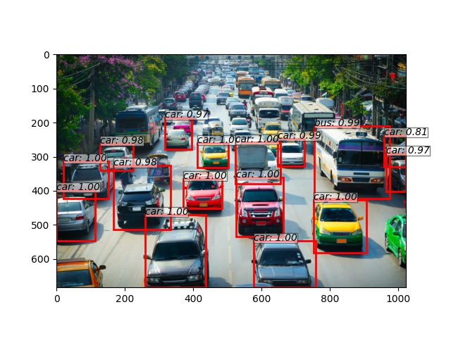
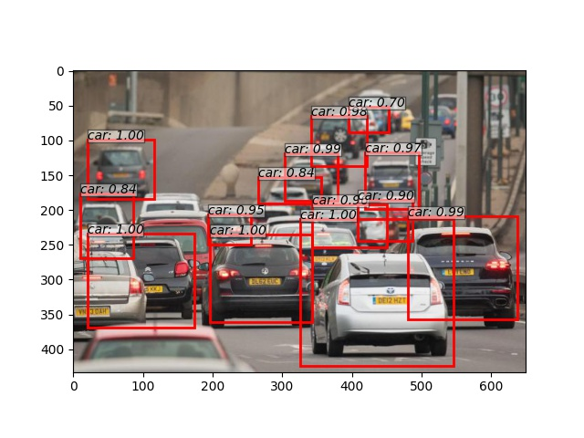
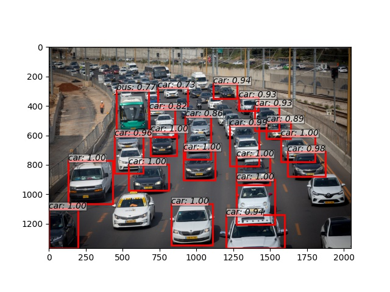

## 1. Introduction
The Traffic Monitoring System require live webcast image of main road for model training and traffic condition monitoring. On Arizona Department of Transport, they provide a http path for user to get image from their server, we can use https://www.az511.gov/map/Cctv/XXXX-XX (XXXX-Xx represent the webcast ID) to get access with the target road snapshot, all of the data will be stored in Firebase Realtime Database so that user can retrieve the data once the traffic condition is updated and display the information on mobile application interface

## 2. Installation
you need to edit the file path used in the python file in order to run it correctly, for example change the file path of run.py in line 26 from r'C:\vehicle_detection_model\model\fasterrcnn_55235744.pth' to r'your_local_machine_file_path' to load the vehicle detection model correctly

Step of running this system:
1. execute run.bat in 'vehicle_detection_model' to run the web scraper and vehicle detection model periodically
	1.1 in order to exectue run.bat correctly you to to install python library by the following command "pip install pytorch torchvision cudatoolkit=10.2 -c pytorch" and "pip install visdom scikit-image tqdm fire ipdb pprint matplotlib torchnet"
2. execute  command "npx react-native run-android "to run App.js which is the mobile application (you need to install android emulator or connected to a real android device)

## 3. Smaeple Detected Image:

## 4.  Mobile Application interface:
The Mobile application is connected to Google Maps API, Google Maps allow developer to customized the maps, mobile application will retrieve the traffic data from database, and then use data – VehiceleCount to create a marker, the icon of the marker represent the number of car detected in that road.

## 5.  Attention!!!
This repo does not contain any gradle, dependencies and node modules files due to size limitation, you need to modify the gradle and install dependency by yourself (include firebase, react-native-maps,react-native-svg and react-native)

'/vehicle_detection_model' is the faster-rcnn object detection model of the system

'/trafficmonitoringsystem' is the mobile application of the system

'/Web_scraper' is the web scraper of the system
